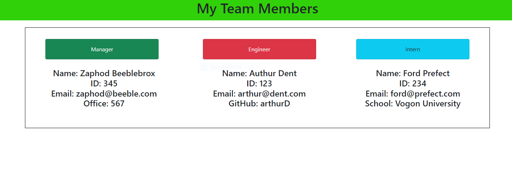

Team Profile Generator

Tracy Torisky

ttorisky@gmail.com

I first created constructors for Employee, Engineer, Intern, and Manager

The Employee class constructor contained all of the basic property and methods that each Employee will need:
Name, ID, and Email

The Manager class was created with the Employee properties and methods inported using Inquirer.  

I then used "extend" to allow the Manager class to access properties and methods from Employee and add to them.

I created a constructor for the Manager class by using ""super" to access the properties and methods from the Employee class,
and then added an additional property "officeNumber."

I repeated this process for the Intern and Engineer classes.  I added "school" to the Intern and "github" to the Engineer class.

I created a list of questions in the index.js file, and then a series of tests in Employee, Engineer, Intern, and Manager.js files.

I was ableto run the tests successfully using "npm run test."  All five tests passed.
